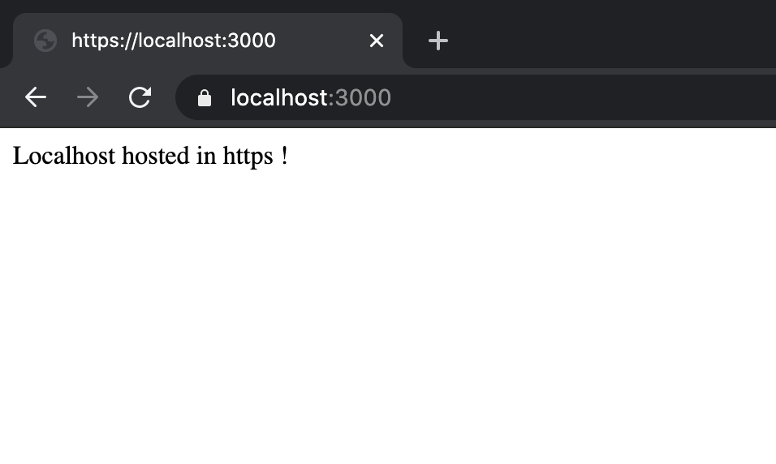

In this article we are going to test our site locally in https using [mkcert](https://github.com/FiloSottile/mkcert) in node & express app. mkcert is a great tool to automatically generates and installs SSL certificates.

Make sure we have ***node.js*** installed in our machine. You can download it [here](https://nodejs.org/en/download/)

## Steps
- Install [Homebrew](https://brew.sh/) (package manager for mac os)
```bash
# only for mac users
/bin/bash -c "$(curl -fsSL https://raw.githubusercontent.com/Homebrew/install/master/install.sh)"
```
- Install [mkcert](https://github.com/FiloSottile/mkcert) to generate all TLS certificates.
* For mac
```bash
brew install mkcert
brew install nss # if you use Firefox
```
* For windows
Follow this [instructions](https://github.com/FiloSottile/mkcert#windows) to install the mkcert.

- Generate trusted cerificate locally
```bash
$ mkcert -install
# Created a new local CA
$ mkcert [domain name]
# In our case, we will use localhost
$ mkcert localhost
```
Above step will generate couple of files [domainname]-key.pem, [domainname].pem.

4. Create an node app and create server js file.
```bash
npm init 
touch server.js
```

4. Install express js 
```bash
npm install express
```

5. Copy these files created in step 3 [domainname]-key.pem, [domainname].pem and paste it in this folder.
6. Include this below code in server.js
```js
'use strict';
const https = require('https');
const express = require('express');
const fs = require('fs');
// load the self-signed certificates
const options = {
    key: fs.readFileSync('[domainname]-key.pem'),
    cert: fs.readFileSync('[domainname].pem'),
  };
const app = express();
app.get('/', (req, res, next) => {
    res.send("Localhost hosted in https !")
});
https.createServer(options, app).listen(3000);
```
7. Start the server
```bash
node server.js
```

8. Test the application by opening the browser and hitting the URL

```
https://localhost:3000/
```

### Test it in the browser

<center>
  <i>Output</i>
  
</center>
